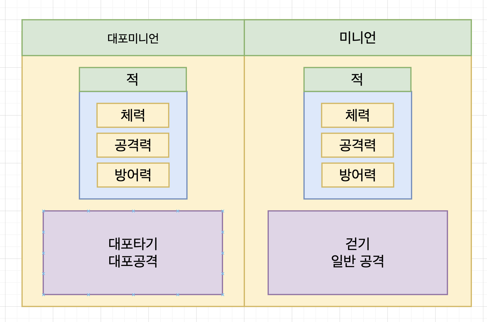

# C# Baics Project

---

## **목차**

`목차의 내용을 선택 시 해당 항목으로 이동합니다.`

<!--챕터 1-->
<details>

<summary><a href="#Chapter" > Chapter 1 </a></summary>

<strong>[Chapter 1 - 1] [C#의 기본](#what-is-c)</strong> </br>
<strong>[Chapter 1 - 2] [자료형](#자료형을-먼저-살펴-봅시다)</strong>

</details>

<!--챕터 2-->
<details>

<summary><a href="#Chapter" > Chapter 2 </a></summary>

<strong>[Chapter 2 - 1] 변수 </strong></br>
<strong>[Chapter 2 - 2] 자료형 </strong>

</details>

<!--챕터 3-->
<details>

<summary><a href="#Chapter" > Chapter 3 </a></summary>

<strong>[Chapter 1 - 1] C#의 기본</strong></br>
<strong>[Chapter 1 - 2] 자료형</strong>

</details>

<!--챕터 4-->
<details>

<summary><a href="#Chapter" > Chapter 4 </a></summary>

<strong>[Chapter 1 - 1] C#의 기본</strong></br>
<strong>[Chapter 1 - 2] 자료형</strong>

</details>

---

# Chapter 1 - 1

> C#의 기본과 객체지향에 대해 알아봅시다.

### What is C# ?

<strong>C</strong> 와 <strong>C++</strong>의 강점, 비주얼 베이직의 편의성을 결합하여 만든 <strong>객체지향 프로그래밍</strong> 언어입니다. <strong>닷넷</strong>을 기반으로 하여 <strong>웹 프로그래밍, 데이터 베이스 프로그래밍, 서버 - 클라이언트 개발, 사물인터넷 (IoT)</strong> 와 같은 거의 모든 프로그래밍에서 사용되는 강력한 언어입니다.

### 객체지향이란?

C#에 꼬리표 처럼 따라오는 <strong>객체지향성</strong> 입니다. 객체지향이란 <strong>필요한 데이터를 추상화시켜 상태와 행동을 가진 객체( Object )</strong> 로 만들고 <strong>객체끼리의 상호작용을 통해 로직을 구성</strong>하는 프로그래밍 기법입니다.

#### **객체지향에는 5대 원칙이 존재합니다.**

1. 클래스 + 인스턴스 ( 객체 )
2. 캡슐화
3. 상속
4. 추상화
5. 다향성

## 1) **클래스 와 인스턴스**

<strong>클래스</strong> - 속성과 행위를 변수와 매서드로 정의한 것
<strong>인스턴스</strong> - 클래스에서 정의한 것을 토대로 실제 메모리에 할당된 객체

## 2) **캡슐화**

- 데이터를 은닉하고 접근하는 기능을 노출시키지 않는다.
- 데이터의 구조와 데이터를 다루는 방볍을 결합시켜 묶는다.

쉽게 캡슐 알약 안에 내부약물을 보호하는 기능을 예로 들면 이해하기 쉽습니다.

캡슐화의 접근을 제어하는 접근지정자 목록입니다.

- public : 모두가 접근 가능한 지시자
- protected : 상속되거나 같은 패키지 내에서만 접근 가능
- private : 본인만 접근 가능

## 3) **상속**

- 상속은 상위 클래스의 내용을 하위 클래스가 물려 내려받는 것 입니다. 쉽게 말하면 부모 클래스의 내용을 자식 클래스에 물려주는 것 과 같습니다.

상속은 먼저 이미지를 보고 가도록 합시다.

<center>

</center>

이처럼 공통으로 가지고 있는 요소를 부모 클래스로 묶고 개개인의 특성을 자식클래스의 구현하도록 합니다. 가장 기본적인 C#의 프로그래밍 구조라고 할 수 있습니다.

<center>

</center>
위의 이미지 처럼 <strong>적</strong> 클래스가 공통으로 가지고 있는 부모 클래스이고, 특성을 가지고 있는 자식 클래스인 미니언들의 클래스에 상속 받아 사용중인 예제입니다.

## 4) **추상화**

- 추상화란 객체의 <strong>공통 속성</strong>을 뽑아내는 것 입니다.

예를 들어 피격을 당했을 때, 적과 플레이어는 데미지를 받는 것 이 것은 공통으로 할당된 이벤트 입니다. 우리는 초점을 <strong>피격을 누가 당했는지</strong> 가 아닌 <strong>"데미지를 받는 것"</strong> 에 대해 추상화를 했다는 것 입니다.

한마디로 사용하기 쉽게 <strong>"추상화"</strong> 한 것 입니다.

# Chapter 1 - 2

> C# 자료형을 알아봅시다.

### 자료형을 먼저 살펴 봅시다.

## 1) <strong>정수형</strong>

- sbyte - 부호 있는 8비트 정수
- byte - 부호 없는 8비트 정수
- short - 부호 있는 16비트 정수
- unshort - 부호 없는 16비트 정수
- int - 부호 있는 16비트 정수
- unint - 부호 있는 32비트 정수
- long - 부호 있는 64비트 정수
- unlong - 부호 없는 64비트 정수

이처럼 정수형에만 여러가지 자료형이 있습니다. 왜냐하면 상황에 맞는 자료형을 사용해야 합니다. <strong>자료형에 따라 할당되는 메모리의 크기가 다르기</strong> 때문에 각 상황에 맞는 자료형을 선택해서 사용해야 합니다. 예를 들어 100명의 학생수를 담을 수 있는 변수를 선언해 보겠습니다.

```cs
// 적절한 자료형 활용
sbyte studentCount = 100;
byte studentCount = 100;

// 부적절한 자료형 활용
int studentCount = 100;
```

아래와 같이 적절한 자료형 활용은 불필요한 메모리를 줄이는 가장 기초적인 방법 중 하나 입니다.

## 2) <strong>실수형</strong>

- float - 32비트
- double - 64비트
- decimal - 128비트

소수점을 포함하기 시작하면 <strong>정확한 수의 표현이 아닌 근사치를 표현</strong>하는데 더 특화 되어 있습니다. 소수점 이하의 모든 수를 표현하는 것은 비효율적 이기 때문에 아주 작지만 조금의 오차범위가 생길 수 밖에 없다. decimal 같은 경우 천문학과 같은 분야에서 <strong>한치의 오차가 허용되지 않을 때</strong> 사용하는 자료형입니다.

## 3) <strong>문자(열)형</strong>

- char - 유니코드 16bit ( 개당 2byte )
- string - 유니코드 16bit 조합

<strong>"유니코드"</strong>란? : 유니코드는 모든 나라의 언어를 표현하기 위해 나온 코드체계, 운영체제, 나라, 프로그램, 언어에 상관없이 문자마다 고유한 코드 값을 제공하는 방식.

## 4) <strong>부울린형</strong>

- bool - 8bit ( 1 byte )

오로지 참과 거짓을 판별할 때 사용하는 자료형 입니다.

---

# Chapter 2 - 1
